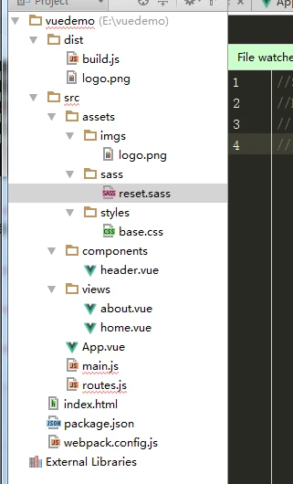

**>开始**（确认已经安装node环境和npm包管理工具）

1、新建项目文件名为vuedemo

2、`npm init -y` 初始化项目


**>安装项目依赖**

3、`npm install --save vue` 默认安装最新版vue

4、`npm install --save-dev webpack webpack-dev-server` 安装webpack，webpack-dev-server（是一个小型的Node.js Express服务器）

*拓展：npm install 在安装 npm 包时，有两种命令参数可以把它们的信息写入 package.json 文件，一个是npm install --save另一个是 npm install --save-dev，他们表面上的区别是--save 会把依赖包名称添加到 package.json 文件 dependencies 键下，--save-dev 则添加到 package.json 文件 devDependencies 键下，
--save-dev 是你开发时候依赖的东西，--save 是你发布之后还依赖的东西。*


5、`npm install --save-dev babel-core babel-loader babel-preset-es2015` 安装babel，babel的作用是将es6的语法编译成浏览器认识的语法es5


6、`npm install --save-dev vue-loader vue-template-compiler` 用来解析vue的组件，.vue后缀的文件

7、`npm install --save-dev css-loader style-loader` 用来解析css

*拓展：css-loader 和 style-loader，二者处理的任务不同，css-loader使你能够使用类似@import 和 url(…)的方法实现 require()的功能,style-loader将所有的计算后的样式加入页面中，二者组合在一起使你能够把样式表嵌入webpack打包后的JS文件中。*

8、`npm install --save-dev url-loader file-loader` 用于打包文件和图片

9、`npm install --save-dev sass-loader node-sass` 用于编译sass

10、`npm install --save-dev vue-router` 安装路由

**>编辑项目目录以及添加代码**

11、文件目录如下；



//dist文件是后面执行webpack指令生产的，不用管；

//webpack.config.js 配置文件，本身也是一个标准的Commonjs规范的模块；

//routes.js文件放路由配置文件；

//index.html首页入口文件

//App.vue是项目入口文件。

//main.js这是项目的核心文件。全局的配置都在这个文件里面配置。

//commponents目录里面放了公共组件header文件。

//views文件放详情页面；

**>代码**
//webpack.config.js
*注释：
test：一个匹配loaders所处理的文件的拓展名的正则表达式（必须）
**loader：**loader的名称（必须）
include/exclude:手动添加必须处理的文件（文件夹）或屏蔽不需要处理的文件（文件夹）（可选）；*

```
var path = require('path')
var webpack = require('webpack')

module.exports = {
    entry: './src/main.js',//值可以是字符串、数组或对象
    output: {
        path: path.resolve(__dirname, './dist'),//Webpack结果存储
        publicPath: '/dist/',//懵懂，懵逼，//然而“publicPath”项则被许多Webpack的插件用于在生产模式和开发模式下下更新内嵌到css、html，img文件里的url值
        filename: 'build.js'
    },
    module: {
        rules: [
            {
                test: /\.vue$/,
                loader: 'vue-loader',
                options: {
                    loaders: {
                    }
                    // other vue-loader options go here
                }
            },
            {
                test: /\.js$/,
                loader: 'babel-loader',
                exclude: /node_modules/
            },
            {
                test: /\.(png|jpg|gif|svg)$/,
                loader: 'file-loader',
                options: {
                    name: '[name].[ext]?[hash]'
                }
            }
            //自己加的
            ,
            {
                test: /\.css$/,
                loader: "style-loader!css-loader"
            }
            ,
            {
                test: /\.scss$/,
                loader: "style-loader!css-loader!sass-loader!"
            }
        ]
    },
    resolve: {
        alias: {
            'vue$': 'vue/dist/vue.esm.js'
        }
    },
    devServer: {//webpack-dev-server配置
        historyApiFallback: true,//不跳转
        noInfo: true,
        inline: true//实时刷新
    },
    performance: {
        hints: false
    },
    devtool: '#eval-source-map'
}

if (process.env.NODE_ENV === 'production') {
    module.exports.devtool = '#source-map'
    // http://vue-loader.vuejs.org/en/workflow/production.html
    module.exports.plugins = (module.exports.plugins || []).concat([
        new webpack.DefinePlugin({
            'process.env': {
                NODE_ENV: '"production"'
            }
        }),
        new webpack.optimize.UglifyJsPlugin({
            sourceMap: true,
            compress: {
                warnings: false
            }
        }),
        new webpack.LoaderOptionsPlugin({
            minimize: true
        })
    ])
}
```

//routes.js

```
// 引用模板
import Vue from 'vue';
import Router from 'vue-router';
import indexPage from './components/header.vue'
import homePage from './views/home.vue'
import aboutPage from './views/about.vue'

Vue.use(Router)

export default new Router({
    routes:[
        {
            path:'/',
            component:homePage
        },
        {
            path:'/about',
            component:aboutPage
        }
    ]
})
```

//index.html

```
<!DOCTYPE html>
<html lang="en">
<head>
    <meta charset="UTF-8">
    <title>Title</title>
</head>
<body>
    <div id="appIndex">

    </div>
    <script src="./dist/build.js"></script>
</body>
</html>
```

//App.vue

```
<!--App.vue是项目入口文件。-->
<template>
    <div id="app">
        <header-tab></header-tab>
        <h2>{{msg}}</h2>
        <div class="nav-box">
            <p class="nav-list">
                <router-link class="nav-item" to="/">首页</router-link>
                <router-link class="nav-item" to="/about">关于</router-link>
            </p>
        </div>
        <div>
            <router-view></router-view>
        </div>
    </div>
</template>

<script>
import HeaderTab from './components/header.vue';
export default {
  name: 'app',
  data () {
    return {
      msg: 'Welcome to Your Vue.js App'
    }
  },
  components:{
    HeaderTab
  }
}
</script>

<style lang="sass">
   /*这里sass编译正常*/
    $redColor:#f00;
    h2{
        color:$redColor;
    }
    #app {
        text-align: center;
        color: #2c3e50;
        margin-top: 60px;
    }
    h1, h2 {
        font-weight: normal;
    }
    ul {
        list-style-type: none;
        padding: 0;
    }
    li {
        text-align: left;
        margin: 0 10px;
    }
    a {
        color: #42b983;
    }
</style>
```

//main.js

```
//main.js这是项目的核心文件。全局的配置都在这个文件里面配置
import Vue from 'vue'
import App from './App.vue'
import router from './routes.js'

import './assets/styles/base.css'
//import './assets/sass/reset.sass'//报错暂时不用sass
Vue.config.debug = true;//开启错误提示

new Vue({
        router,
        el: '#appIndex',
        render: h => h(App)
})
```

//commponents

```
<template>
    <div>
        <h1>共同header</h1>
        
    </div>
</template>
```

*注意：别忘了添加图片*

//views文件放详情页面；

about.vue

```
//about.vue
<template>
    <div>about</div>
</template>
```

home.vue

```
//index.vue
<template>
    <div>
        <ol>
            <li v-for="todo in todos">
                {{ todo.text }}
            </li>
        </ol>
        <button @click="eClick()">事件</button>
    </div>
</template>

<script>
export default {
  name: 'indexP',
  data () {
    return {
       todos: [
          { text: 'Learn JavaScript' },
          { text: 'Learn Vue' },
          { text: 'Build something awesome' }
        ]
    }
  },
  methods:{
    eClick(){
        console.log(9999);
    }
  }
}
</script>
```

//base.css

```
h1{
    color: #999;
}
```

//reset.sass(这个屏蔽起来先，有报错，，)

```
//$redColor:#f00;
//h2{
//  color:$redColor;
//}
```

**>项目跑起来**

执行指令

```
webpack
```


执行webpack-dev-server：

```
webpack-dev-server
```


浏览器打开生成的链接：如我这里是[http://localhost](http://localhost/):8083

首页详情页效果：


关于详情页效果：


ok，希望小伙伴们可以一次跑通项目流程
补充：
**把webpack和webpack-dev-server命令转成npm命令**

安装 across-env:npm install cross-env --save-dev

```
npm install cross-env --save-dev
```

package.json 文件添加

```
"dev": "cross-env NODE_ENV=development webpack-dev-server --open --hot",
"build": "webpack"
```


ok，执行npm指令npm run dev,浏览器打开新窗口（相当于把npm的dev命令指向webpack-dev-server命令）；

```
npm run dev
```

执行npm run build(相当于把npm的build指令指向webpack命令)

```
npm run build
```

遇到的问题：

1、外部引入.sass文件报错，<style lang="sass"></style>里面的sass语法编译正常；（上面我屏蔽了sass）
以上结尾。

**==================2018/01笔记===============================**
**vue-cli搭建vue项目流程**

1、下载安装node环境和npm包管理工具；(node -v;npm -v检查版本)；
2、npm install -g vue-cli;使用npm全局安装vue-cli；(vue -V)(1.在安装vue-cli时，已经自带安装webpack。)
3、vue init webpack projectname；生成项目模板（1.webpack是模板名称，这里我们需要使用webpack的打包功能，所以使用webpack；2.projectname是项目名称）
4、cd projectname
5、npm run dev
6、npm run bulid
**注意：文件目录路径不能有中文，会报错**